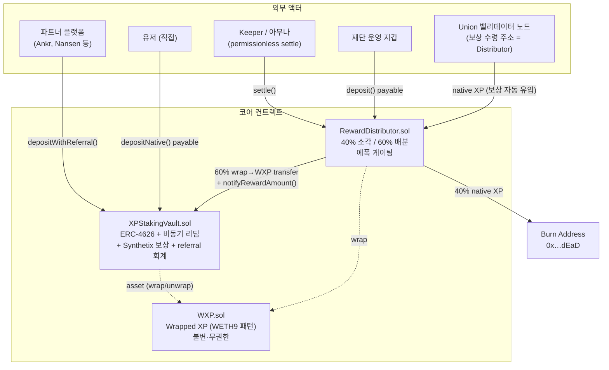
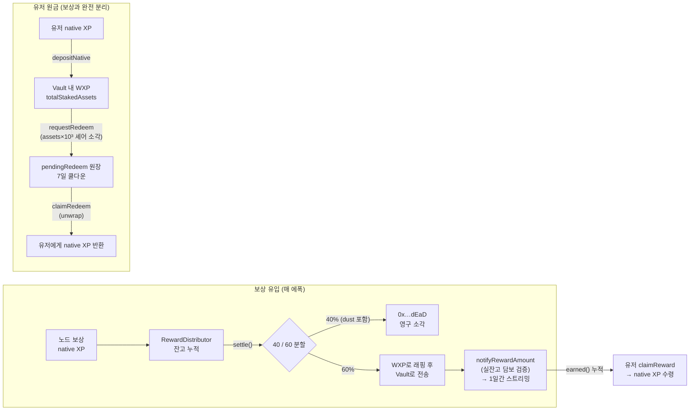
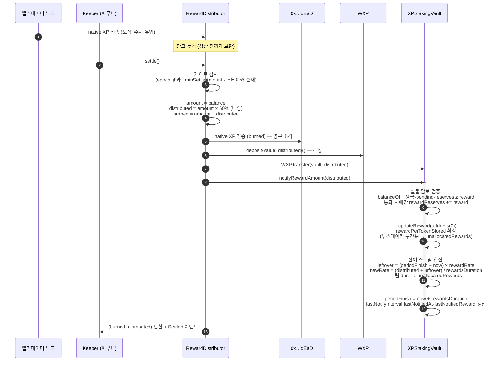
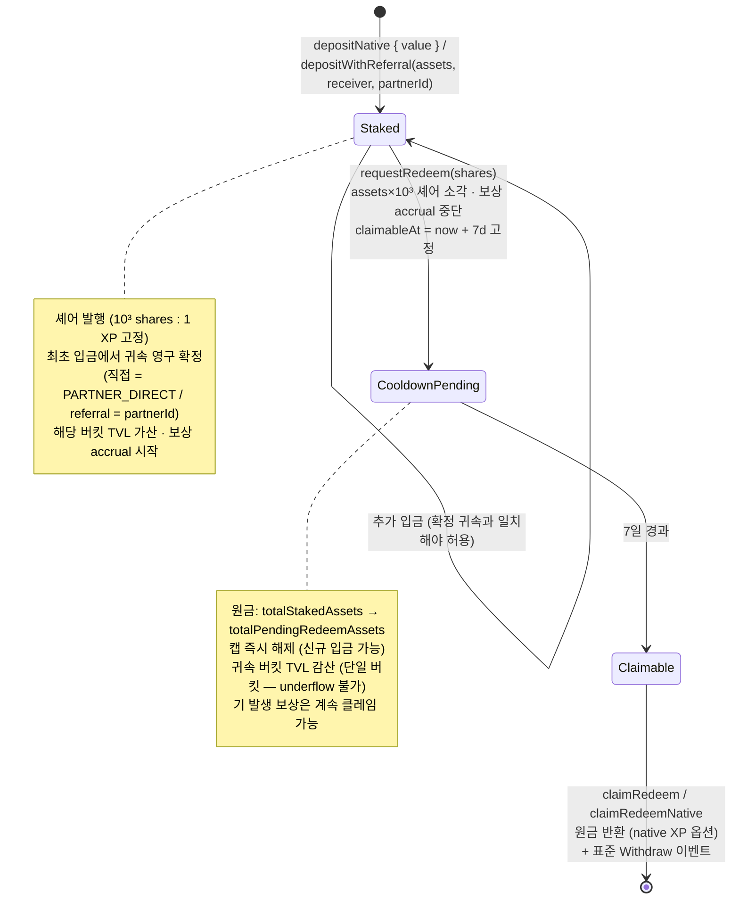

# Xphere Union Staking Vault — 아키텍처 설계 문서

> **버전**: v0.2 (Phase 1 설계 리뷰용 — 적대적 검증 1라운드 반영)
> **대상 체인**: Xphere 메인넷 (EVM 호환 L1, 네이티브 코인 XP)
> **스택**: Solidity ^0.8.24, OpenZeppelin Contracts v5, Foundry
> **상태**: 설계 리뷰 대기 — 승인 후 Phase 2(구현) 진행
> **검증 이력**: v0.1 초안에 대해 5개 렌즈(표준·보안·경제·완전성·엣지케이스) × 적대적 검증(37건 발견 → 28건 확정)을 수행, 전량 본 버전에 반영. 상세는 §13.

---

## 0. 개요 및 확정 파라미터

Xphere 재단이 운영하는 Union 밸리데이터 노드의 보상 전액을 받아, **40%를 영구 소각**하고 **60%를 스테이커에게 pro-rata 분배**하는 스테이킹 볼트 시스템. 유저 원금은 노드로 재위임되지 않고 볼트 컨트랙트에 그대로 보관된다(락 전용). 핵심 목적은 소각이며 유저 보상은 부수적 인센티브다.

### 0.1 확정 파라미터 (§2 — 변경 금지)

| 파라미터 | 기본값 | 조정 주체 | 비고 |
|---|---|---|---|
| `distributionRatioBps` (스테이커 배분율) | 6,000 (60%) | `PARAM_ADMIN` | 나머지 40% 소각 |
| `stakeCap` (전역 스테이킹 캡) | 35,000,000 XP | `PARAM_ADMIN` | 원금 기준 |
| `cooldownPeriod` (언스테이킹 쿨다운) | 7 days | `PARAM_ADMIN` | 요청→대기→클레임 |
| `epochDuration` (정산 주기) | 1 days | `PARAM_ADMIN` | settle 게이팅 주기 |
| `rewardsDuration` (보상 스트리밍 기간) | 1 days | `PARAM_ADMIN` | Synthetix 스트리밍 창 |
| 고정 APR | 없음 | — | `유입 × 60% × 365 / TVL` 자동 결정 |

모든 수치 파라미터는 하드코딩하지 않고 constructor 주입 + setter로 조정한다. 각 파라미터의 상·하한 경계(`maxCooldown`, `minRewardsDuration`/`maxRewardsDuration`, `minEpochDuration`/`maxEpochDuration`)도 constructor 주입 immutable로 둔다(§3 setter 명세 참조). 유일한 예외는 `_DECIMALS_OFFSET = 3`으로, 환율 고정 증명(§7.1)에 내재된 구조 상수라 의도적으로 constant 선언한다(§9 편차 표에 명시).

**파라미터 간 운영 제약**: `rewardsDuration ≤ epochDuration`을 유지할 것(권장 기본: 동일 값). 위반 시 APR 표시 왜곡과 leftover 중첩이 발생한다(§6.14). 두 값은 서로 다른 컨트랙트에 있어 온체인 교차 검증이 불가하므로 운영 절차(타임락 공시에 두 변경을 함께 배치)로 강제하고, Phase 2 테스트에 불일치 케이스를 포함한다.

### 0.2 시스템 특성 요약

- **유입량 무관 동작**: 일일 유입이 27,027 XP든, 매년 2월 ×0.7273 감쇠 이후의 소량이든, 시스템은 "받은 만큼만 나눈다". rewardRate는 **실측 잔고로 담보 검증된** 토큰량 기준으로만 산정되므로 잔고 초과 약속이 구조적으로 불가능하다(§3.2 notifyRewardAmount).
- **원금-보상 회계 분리**: 유저 원금(`totalStakedAssets`)과 보상 풀(`rewardReserves`)은 별도 원장으로 관리. 노드 슬래싱·보상 중단 시에도 원금 100% 인출 가능.
- **소각 우선**: 정산 시 나눗셈 dust는 소각분에 귀속(rounding은 소각·볼트에 유리한 방향).

---

## 1. 컨트랙트 구성도

### 1.1 컴포넌트 관계



### 1.2 자금 흐름



### 1.3 컨트랙트 책임 분리

| 컨트랙트 | 책임 | 보유 자산 | 권한 구조 |
|---|---|---|---|
| `WXP` | 네이티브 XP ↔ ERC-20 래핑 | native XP (래핑 준비금) | 없음 (불변) |
| `XPStakingVault` | 원금 보관, 셰어 발행, 쿨다운 리딤, 보상 accrual/클레임, 파트너 회계, 캡 | WXP (원금 + 보상 준비금) | AccessControl |
| `RewardDistributor` | 보상 수령, 에폭 정산, 소각 실행, 볼트 통지 | native XP (미정산 보상) | AccessControl |

분리 이유: (1) 소각/배분 비율 로직 변경·업그레이드 시 볼트(유저 자금)를 건드리지 않음, (2) 노드 보상 수령 주소를 Distributor로 지정하면 유입 경로가 온체인에서 완결됨, (3) 볼트는 "받은 보상을 나눠주는" 단일 책임만 가짐.

---

## 2. 상태 변수 전체 목록

### 2.1 WXP.sol (WETH9 패턴 — 상태 최소화)

| 변수 | 타입 | 역할 |
|---|---|---|
| `name` / `symbol` / `decimals` | `string` / `string` / `uint8` | "Wrapped XP" / "WXP" / 18 |
| `balanceOf` | `mapping(address => uint256)` | ERC-20 잔고 |
| `allowance` | `mapping(address => mapping(address => uint256))` | ERC-20 승인 |

- `totalSupply()`는 `address(this).balance`를 반환 (WETH9 방식) → 래핑량 = 예치된 native XP와 항상 일치.
- 소유자·관리 함수 없음. 배포 후 불변.

### 2.2 XPStakingVault.sol

**상속**: `ERC4626`(OZ v5) → `ERC20`, `AccessControl`, `Pausable`, `ReentrancyGuard`

#### 원금·셰어 회계

| 변수 | 타입 | 역할 |
|---|---|---|
| `totalStakedAssets` | `uint256` | **내부 추적 원금 총액** (= `totalAssets()` 반환값). `balanceOf(WXP)`를 쓰지 않아 donation이 환율에 영향 불가 |
| `totalPendingRedeemAssets` | `uint256` | 쿨다운 대기 중인 원금 부채 총액 (셰어는 이미 소각됨) |
| `stakeCap` | `uint256` | 전역 스테이킹 캡 (원금 기준, 기본 35M XP). `totalStakedAssets` 미만으로 하향 가능 — 이 경우 신규 입금만 차단되며 `maxDeposit`은 0을 반환(saturating, revert 금지) |
| `_DECIMALS_OFFSET` | `uint8 constant = 3` | OZ virtual-share offset. 내부 회계와 이중 방어. 구조 상수(§0.1 예외) |

> **환율 불변성**: `totalAssets`를 내부 변수로만 갱신하고 보상을 share price에 반영하지 않으며, 모든 셰어 소각·발행을 10³ 배수로 정렬(§3.2 requestRedeem/mint 규칙)하므로, 셰어:자산 환율은 배포 시점부터 영구히 `10³ : 1` **등식**으로 고정된다(증명 §7.1, 불변식 I-2). 첫 입금자 공격·donation 공격이 구조적으로 무력화된다.

#### 비동기 리딤 (ERC-7540 영감)

| 변수 | 타입 | 역할 |
|---|---|---|
| `cooldownPeriod` | `uint256` | 쿨다운 기간 (기본 7 days) |
| `maxCooldown` | `uint256 immutable` | `cooldownPeriod` 상한 (constructor 주입, 권장 30 days) — 관리자 남용 방지용 경계라 immutable |
| `_nextRequestId` | `uint256` | 전역 요청 ID 카운터 (1부터 시작) |
| `redeemRequests` | `mapping(uint256 => RedeemRequest)` | 요청 원장 |
| `_userRequestIds` | `mapping(address => uint256[])` | 유저(controller)별 요청 ID 목록 (view 편의용) |
| `isOperator` | `mapping(address => mapping(address => bool))` | ERC-7540 operator 승인 |

```solidity
struct RedeemRequest {
    address controller;   // 클레임 권한자
    uint96  claimableAt;  // 쿨다운 만료 시각 (요청 시점에 고정 — 이후 cooldown 변경의 소급 적용 방지)
    uint256 assets;       // 반환 예정 원금 (요청 시점 환산·확정)
    bool    claimed;
}
```

#### 보상 accrual (Synthetix StakingRewards 패턴)

| 변수 | 타입 | 역할 |
|---|---|---|
| `rewardsDuration` | `uint256` | 보상 스트리밍 창 (기본 1 days). **다음 notify부터 적용** — 진행 중 스트림과 무관하므로 변경에 대기 조건 불요(§3.2) |
| `minRewardsDuration` / `maxRewardsDuration` | `uint256 immutable` | 스트리밍 창 경계 (constructor 주입, 권장 1 hours / 30 days). 0 설정으로 인한 notify division-by-zero(→ settle 전체 중단)를 차단 |
| `periodFinish` | `uint256` | 현재 스트리밍 종료 시각 |
| `rewardRate` | `uint256` | 초당 보상량 (실측 담보 검증된 토큰 기준으로만 산정) |
| `lastUpdateTime` | `uint256` | 마지막 accrual 갱신 시각 |
| `rewardPerTokenStored` | `uint256` | 셰어당 누적 보상 (1e18 스케일) |
| `userRewardPerTokenPaid` | `mapping(address => uint256)` | 유저별 정산 기준점 |
| `rewards` | `mapping(address => uint256)` | 유저별 미클레임 보상 |
| `rewardReserves` | `uint256` | 보상용 WXP 준비금 원장 (notify 시 실잔고 검증 후 +, claim 시 −). 원금과의 회계 분리 핵심 |
| `unallocatedRewards` | `uint256` | **좌초 보상 카운터**: (a) `totalSupply()==0` 구간에 스트리밍이 흘려보낸 미배분량, (b) notify의 rate 내림 dust `(reward+leftover) − newRate×duration`을 온체인 적립. `sweepUnallocatedRewards`의 회수 한도 = 이 값 (유저 미클레임 보상과 집합이 겹치지 않음 — §8.4) |
| `lastNotifiedReward` | `uint256` | 최근 notify 금액 (`currentAPR()` 계산용) |
| `lastNotifiedAt` | `uint256` | 최근 notify 시각 |
| `lastNotifyInterval` | `uint256` | 직전 두 notify 간 실측 간격 (`currentAPR()` 연율화 분모 — 파라미터 불일치에 강건) |
| `totalRewardsDistributed` | `uint256` | 누적 배분량 (대시보드용) |

> **denominator**: `rewardPerToken`의 분모는 `totalSupply()` (= 활성 스테이킹 셰어). requestRedeem 시 셰어를 즉시 소각하므로 쿨다운 중인 물량은 자동으로 보상 대상에서 제외된다. 별도 에스크로 추적 변수가 불필요.

#### 파트너(referral) 회계

| 변수 | 타입 | 역할 |
|---|---|---|
| `PARTNER_DIRECT` | `bytes32 constant = keccak256("DIRECT")` | 직접 유입 sentinel. `bytes32(0)`("미확정")과 명확히 구분 |
| `partners` | `mapping(bytes32 => Partner)` | 파트너 등록 정보. `PARTNER_DIRECT` 버킷은 등록 절차 없이 상시 유효(subCap 무제한) |
| `userPartner` | `mapping(address => bytes32)` | 유저(receiver) → 귀속. `bytes32(0)` = **미확정(입금 이력 없음)**, `PARTNER_DIRECT` = 직접 귀속, 그 외 = 파트너 귀속. **최초 입금 트랜잭션에서 영구 확정** (§3.2 귀속 규칙) |
| `userPrincipal` | `mapping(address => uint256)` | 유저별 원금. 유저의 전 원금이 단일 귀속 버킷에 존재하므로 TVL 감산 underflow가 구조적으로 불가(불변식 I-8) |

```solidity
struct Partner {
    bool    active;    // 등록·활성 여부 (신규 유치 가능)
    uint256 subCap;    // 파트너별 sub-cap. 0 = 무제한(전역 캡만 적용)
    uint256 tvl;       // 파트너 귀속 원금 총액
}
```

> 커미션 계산·지급 로직은 **온체인에 두지 않는다**(§3.2 요구). 오프체인 정산 조회 모델: `Deposited`의 **indexed** `partnerId`로 파트너별 receiver 집합을 얻고, `RedeemRequested`를 indexed `owner`/`requestId`로 조인해 인출을 반영한다(`RedeemRequested`의 `partnerId`는 비인덱스 data 필드로 검증용 — indexed 3슬롯은 owner·controller·requestId가 점유). 셰어가 비양도이고 귀속이 유저당 단일·영구라 이 조인만으로 파트너별 TVL 시계열이 완결된다. 추후 커미션 모듈이 필요하면 이벤트·view를 소비하는 별도 컨트랙트로 추가한다(볼트 변경 불요).

#### 접근 제어 역할

| 역할 | 권한 |
|---|---|
| `DEFAULT_ADMIN_ROLE` | 역할 부여/회수 (멀티시그 or 타임락 — §8.3) |
| `PARAM_ADMIN_ROLE` | `setStakeCap`, `setCooldownPeriod`, `setRewardsDuration`, `sweepUnallocatedRewards` |
| `PARTNER_MANAGER_ROLE` | `registerPartner`, `setPartnerCap`, `setPartnerActive`, `reassignUserPartner` |
| `PAUSER_ROLE` | `pause` / `unpause` (입금만 차단) |
| `DISTRIBUTOR_ROLE` | `notifyRewardAmount` (RewardDistributor에만 부여) |

### 2.3 RewardDistributor.sol

**상속**: `AccessControl`, `ReentrancyGuard`

| 변수 | 타입 | 역할 |
|---|---|---|
| `vault` | `IXPStakingVault immutable` | 대상 볼트 |
| `wxp` | `IWXP immutable` | 래핑 컨트랙트 |
| `burnAddress` | `address immutable` | 소각 주소 (기본 `0x…dEaD`, constructor 주입) |
| `distributionRatioBps` | `uint16` | 스테이커 배분율 bps (기본 6,000). 소각율 = `10000 − ratio` |
| `epochDuration` | `uint256` | 정산 최소 간격 (기본 1 days) |
| `minEpochDuration` / `maxEpochDuration` | `uint256 immutable` | 정산 간격 경계 (constructor 주입, 권장 1 hours / 30 days) |
| `lastSettledAt` | `uint256` | 마지막 settle 시각. **에폭 인덱스가 아닌 타임스탬프 게이팅** → `epochDuration` 변경에 강건 |
| `minSettleAmount` | `uint256` | settle 최소 금액 (dust-settle 그리핑 방지, §6.8) |
| `totalBurned` | `uint256` | 누적 소각량 (§3.4 필수 view) |
| `totalDistributed` | `uint256` | 누적 배분량 |
| `totalSweptIn` | `uint256` | 볼트에서 sweep으로 재유입된 누적량 — `Settled` 합계와 노드 유입량의 이중 계상 방지용 분리 카운터(§8.4) |
| `lastSettlement` | `Settlement` | 최근 정산 스냅샷 (대시보드용) |

```solidity
struct Settlement {
    uint64  settledAt;
    uint256 totalAmount;
    uint256 burned;
    uint256 distributed;
}
```

| 역할 | 권한 |
|---|---|
| `DEFAULT_ADMIN_ROLE` | 역할 관리 |
| `PARAM_ADMIN_ROLE` | `setDistributionRatio`, `setEpochDuration`, `setMinSettleAmount` |

---

## 3. 함수 시그니처 + 접근 제어 + 이벤트

### 3.1 WXP.sol

```solidity
// ERC-20 표준 전체 + 아래
function deposit() external payable;              // native XP → WXP
function withdraw(uint256 wad) external;          // WXP → native XP
receive() external payable;                       // deposit()과 동일

event Deposit(address indexed dst, uint256 wad);
event Withdrawal(address indexed src, uint256 wad);
```

### 3.2 XPStakingVault.sol

#### 입금 (모두 `whenNotPaused` + `nonReentrant`)

```solidity
// ERC-4626 표준 (오버라이드: 캡·파트너 회계·pause 반영)
function deposit(uint256 assets, address receiver) public override returns (uint256 shares);
function mint(uint256 shares, address receiver) public override returns (uint256 assets);
    // require(shares % 10**_DECIMALS_OFFSET == 0) — 환율 등식 보존 (§7.1, §9 편차 표)

// 네이티브 진입 (내부에서 WXP 래핑 후 표준 deposit 경로 재사용)
function depositNative(address receiver) external payable returns (uint256 shares);

// 파트너 referral 진입
function depositWithReferral(uint256 assets, address receiver, bytes32 partnerId)
    external returns (uint256 shares);
function depositNativeWithReferral(address receiver, bytes32 partnerId)
    external payable returns (uint256 shares);
```

**귀속 규칙 (전 입금 경로 공통)** — receiver의 **최초 입금 트랜잭션에서 귀속을 영구 확정**한다:

| 상황 | 동작 |
|---|---|
| `userPartner[receiver] == 0` (미확정) + 일반 입금 경로 | `PARTNER_DIRECT`로 확정, direct 버킷 TVL 가산 |
| `userPartner[receiver] == 0` + referral 입금 | **`msg.sender == receiver` 또는 `isOperator[receiver][msg.sender]`일 때만** `partnerId`로 확정 (제3자의 1 wei 귀속 선점 front-run 차단 — §6.12). 제3자 호출이면 `UnauthorizedAttribution()` revert |
| 귀속 확정 이후 일반 입금 | 확정된 버킷(direct 또는 파트너)에 가산. 파트너 귀속 유저는 sub-cap 검사 동일 적용(우회 차단) |
| 귀속 확정 이후 referral 입금 | `partnerId == userPartner[receiver]`일 때만 통과, 불일치 시 `PartnerMismatch()` revert. 직접 귀속(`PARTNER_DIRECT`) 유저의 referral 입금도 revert — 혼합 원금으로 인한 TVL 감산 파탄을 원천 차단(§6.7) |
| referral 입금의 `partnerId` | `partners[partnerId].active == true`인 등록 파트너만 유효. `bytes32(0)`·`PARTNER_DIRECT` 지정 시 revert |

- 캡 검사: `assets > maxDeposit(receiver)` 시 `ERC4626ExceededMaxDeposit` revert (부분 입금 없음). 파트너 귀속 유저는 `min(전역 잔여, 파트너 sub-cap 잔여)`가 한도.
- 결과 불변식: **유저의 전 원금은 항상 정확히 하나의 버킷에 존재** → requestRedeem의 TVL 감산이 underflow할 수 없다(I-8).

#### 비동기 리딤 (ERC-7540 영감 — pause와 무관하게 항상 가능)

```solidity
function requestRedeem(uint256 shares, address controller, address owner)
    external nonReentrant returns (uint256 requestId);
    // msg.sender == owner 이거나 isOperator[owner][msg.sender] 필요.
    // 셰어 정렬 규칙: assets = shares / 10³ (floor); require(assets > 0);
    //   burnShares = assets × 10³ 만 소각 — 10³ 미만 잔여 셰어(가치 < 0.001 XP)는
    //   owner가 계속 보유(보상 accrual 유지) → S = 10³·A 등식 보존 (§7.1)
    // claimableAt = now + cooldownPeriod 고정. partnerTVL·userPrincipal은 assets만큼 감산.

function claimRedeem(uint256 requestId, address receiver)
    external nonReentrant returns (uint256 assets);       // WXP로 수령
function claimRedeemNative(uint256 requestId, address receiver)
    external nonReentrant returns (uint256 assets);       // unwrap 후 native XP로 수령
    // 두 함수 모두 표준 ERC-4626 Withdraw(msg.sender, receiver, controller, assets, assets×10³)
    // 이벤트를 클레임 시점에 방출 (ERC-7540 관례 — 4626 인덱서의 TVL 플로우 추적 보장)

function setOperator(address operator, bool approved) external returns (bool);

// ERC-7540 스타일 view
function pendingRedeemRequest(uint256 requestId, address controller) external view returns (uint256 shares);
function claimableRedeemRequest(uint256 requestId, address controller) external view returns (uint256 shares);
function getUserRequestIds(address controller) external view returns (uint256[] memory);

// 동기 인출 경로는 비활성 (의도적 편차 — §9)
function withdraw(uint256, address, address) public override returns (uint256); // revert AsyncRedeemOnly()
function redeem(uint256, address, address) public override returns (uint256);   // revert AsyncRedeemOnly()
function maxWithdraw(address) public view override returns (uint256);           // 0 반환
function maxRedeem(address) public view override returns (uint256);             // 0 반환
```

#### 보상 (pause와 무관하게 항상 가능)

```solidity
function claimReward(address receiver) external nonReentrant returns (uint256 amount);       // WXP
function claimRewardNative(address receiver) external nonReentrant returns (uint256 amount); // native XP

function notifyRewardAmount(uint256 reward) external onlyRole(DISTRIBUTOR_ROLE);
    // ── 실물 담보 검증 (자기참조 원장 검사가 아님) ──
    // uint256 unbacked = wxp.balanceOf(address(this))
    //                    − totalStakedAssets − totalPendingRedeemAssets − rewardReserves;
    // require(unbacked >= reward, RewardNotFunded());
    // rewardReserves += reward;   // 검증 통과 후에만 원장 증액
    // ── Synthetix accrual ──
    // _updateReward(address(0));  // totalSupply==0 구간 좌초분은 unallocatedRewards로 적립
    // leftover = (now < periodFinish) ? (periodFinish − now) × rewardRate : 0;
    // newRate  = (reward + leftover) / rewardsDuration;          // 변경된 duration은 여기서부터 적용
    // unallocatedRewards += (reward + leftover) − newRate × rewardsDuration;  // 내림 dust 적립
    // periodFinish = now + rewardsDuration;
    // lastNotifyInterval = lastNotifiedAt > 0 ? now − lastNotifiedAt : rewardsDuration;
    // lastNotifiedAt = now; lastNotifiedReward = reward;
    //
    // → DISTRIBUTOR_ROLE이 탈취되어도 실물 WXP 전송 없이는 notify가 불가능하다.
    //   가짜 notify로 rewardRate를 부풀려 유저 원금을 잠식하는 경로가 차단된다 (§7.5).

function earned(address account) public view returns (uint256);
function rewardPerToken() public view returns (uint256);

function sweepUnallocatedRewards() external onlyRole(PARAM_ADMIN_ROLE);
    // unallocatedRewards 한도까지만 WXP를 Distributor로 반환(rewardReserves 동시 감산).
    // 유저 미클레임 earned는 rewardPerTokenStored에 이미 반영된 별개 집합이라 침해 불가(§8.4).
    // Distributor는 이를 unwrap해 다음 settle 총액에 합산 — 40/60 재적용, totalSweptIn으로 분리 계상.
```

#### 관리

```solidity
function setStakeCap(uint256 newCap) external onlyRole(PARAM_ADMIN_ROLE);
    // newCap < totalStakedAssets 허용 (신규 입금만 차단, 기존 자금 영향 없음).
    // 이 상태에서 maxDeposit은 saturating 0 반환 — revert 아님 (§3.4)
function setCooldownPeriod(uint256 newPeriod) external onlyRole(PARAM_ADMIN_ROLE);
    // require(newPeriod <= maxCooldown); 기존 요청의 claimableAt은 불변(소급 금지)
function setRewardsDuration(uint256 newDuration) external onlyRole(PARAM_ADMIN_ROLE);
    // require(minRewardsDuration <= newDuration && newDuration <= maxRewardsDuration);
    // 즉시 저장되지만 rewardsDuration은 notifyRewardAmount에서만 읽히므로
    // 진행 중 스트림(rate·periodFinish 확정 완료)에는 영향 없음 — 다음 notify부터 적용.
    // ※ Synthetix 원본의 require(now > periodFinish) 대기 조건은 채택하지 않는다:
    //   permissionless settle이 매 에폭 periodFinish를 연장하므로 그 조건은
    //   영구 데드락이 된다(§6.14). 다음-notify-적용 방식은 대기 조건 자체가 불필요.

function registerPartner(bytes32 partnerId, uint256 subCap) external onlyRole(PARTNER_MANAGER_ROLE);
    // require(partnerId != bytes32(0) && partnerId != PARTNER_DIRECT) — sentinel 충돌 금지
function setPartnerCap(bytes32 partnerId, uint256 subCap) external onlyRole(PARTNER_MANAGER_ROLE);
    // subCap < 현재 tvl 허용 (신규 유치만 차단). maxDeposit은 saturating 0 (§3.4)
function setPartnerActive(bytes32 partnerId, bool active) external onlyRole(PARTNER_MANAGER_ROLE);
    // 비활성화 시 신규 유치만 차단. 기존 TVL·인출·보상은 영향 없음
function reassignUserPartner(address user, bytes32 newPartnerId) external onlyRole(PARTNER_MANAGER_ROLE);
    // 분쟁·실수 복구용 (기본 범위 포함 — §6.12의 유일한 관리적 구제 수단).
    // userPrincipal[user] 전액을 구 버킷 tvl에서 신 버킷 tvl로 이관 (신 버킷 sub-cap 검사 포함).
    // 타임락 경유 실행 권장 (§8.3)

function pause() external onlyRole(PAUSER_ROLE);    // 입금 계열만 차단
function unpause() external onlyRole(PAUSER_ROLE);
```

#### 통합용 view (§3.4 필수)

```solidity
function currentAPR() external view returns (uint256);
    // = lastNotifiedReward × 365 days × 1e18 / (lastNotifyInterval × totalStakedAssets)
    // 연율화 분모가 "직전 두 notify 간 실측 간격"이므로 rewardsDuration·epochDuration
    // 설정 불일치에도 왜곡되지 않는다. totalStakedAssets == 0 이면 0.
    // 스케일: 1e18 == 100% APR (예: 0.169e18 == 16.9%)
function partnerTVL(bytes32 partnerId) external view returns (uint256);
function partnerInfo(bytes32 partnerId) external view returns (bool active, uint256 subCap, uint256 tvl);
function totalAssets() public view override returns (uint256);      // = totalStakedAssets
function maxDeposit(address receiver) public view override returns (uint256);
    // paused → 0.
    // global = stakeCap > totalStakedAssets ? stakeCap − totalStakedAssets : 0   (saturating)
    // bucket = 파트너 귀속 시: subCap == 0 ? ∞ : (subCap > tvl ? subCap − tvl : 0) (saturating)
    // 반환 = min(global, bucket) — cap·subCap이 현재 TVL 미만으로 하향돼도 절대 revert하지 않음
function maxMint(address receiver) public view override returns (uint256);      // maxDeposit × 10³
function totalPendingRedeem() external view returns (uint256);       // 쿨다운 대기 원금
function rewardBalanceOf(address account) external view returns (uint256);  // = earned()
```

#### 이벤트

```solidity
event Deposited(address indexed sender, address indexed receiver, uint256 assets, uint256 shares, bytes32 indexed partnerId);
event RedeemRequested(address indexed owner, address indexed controller, uint256 indexed requestId, uint256 shares, uint256 assets, uint256 claimableAt, bytes32 partnerId);
event RedeemClaimed(address indexed controller, address indexed receiver, uint256 indexed requestId, uint256 assets, bool native);
event RewardNotified(uint256 reward, uint256 rewardRate, uint256 periodFinish);
event RewardClaimed(address indexed account, address indexed receiver, uint256 amount, bool native);
event UnallocatedRewardsSwept(uint256 amount);
event OperatorSet(address indexed controller, address indexed operator, bool approved);
event StakeCapUpdated(uint256 oldCap, uint256 newCap);
event CooldownPeriodUpdated(uint256 oldPeriod, uint256 newPeriod);
event RewardsDurationUpdated(uint256 oldDuration, uint256 newDuration);
event PartnerRegistered(bytes32 indexed partnerId, uint256 subCap);
event PartnerCapUpdated(bytes32 indexed partnerId, uint256 oldCap, uint256 newCap);
event PartnerStatusUpdated(bytes32 indexed partnerId, bool active);
event PartnerReassigned(address indexed user, bytes32 indexed oldPartnerId, bytes32 indexed newPartnerId, uint256 principal);
```

> 표준 이벤트 방출 정책: ERC-4626 `Deposit`은 표준 입금 경로에서, `Withdraw`는 ERC-7540 관례에 따라 **클레임 시점**(`claimRedeem`/`claimRedeemNative`)에 방출한다. `Withdraw`의 shares 필드는 고정 환율로 `assets × 10³` 재계산(스토리지 추가 불요). 이로써 `Σ Deposit − Σ Withdraw` 기반 4626 인덱서·서브그래프의 TVL 추적이 정상 동작한다.

### 3.3 RewardDistributor.sol

```solidity
receive() external payable;                    // 노드 보상 자동 유입 경로
function deposit() external payable;           // 재단 수동 주입 경로 (이벤트 구분용)

function settle() external nonReentrant returns (uint256 burned, uint256 distributed);
    // permissionless. 조건:
    //   block.timestamp >= lastSettledAt + epochDuration  (에폭당 1회)
    //   address(this).balance >= minSettleAmount           (dust-settle 그리핑 방지)
    //   vault.totalSupply() > 0                            (스테이커 부재 시 NoActiveStake revert — §6.1)
    // 처리:
    //   amount      = address(this).balance
    //   distributed = amount * distributionRatioBps / 10_000   (내림)
    //   burned      = amount − distributed                     (dust는 소각분에 귀속)
    //   (1) burnAddress로 native burned 전송
    //   (2) wxp.deposit{value: distributed}() 후 vault로 transfer
    //   (3) vault.notifyRewardAmount(distributed)               — transfer→notify 원자 실행
    //   lastSettledAt = block.timestamp

function receiveSweep() external payable;      // vault의 sweepUnallocatedRewards 수령 전용
    // msg.sender == address(vault) 검사(또는 WXP 수령 후 unwrap 경로), totalSweptIn += amount

function canSettle() external view returns (bool, string memory reason);

function setDistributionRatio(uint16 newRatioBps) external onlyRole(PARAM_ADMIN_ROLE);
    // require(newRatioBps <= 10_000). 다음 settle부터 적용
function setEpochDuration(uint256 newDuration) external onlyRole(PARAM_ADMIN_ROLE);
    // require(minEpochDuration <= newDuration && newDuration <= maxEpochDuration)
function setMinSettleAmount(uint256 newMin) external onlyRole(PARAM_ADMIN_ROLE);

// §3.4 필수 view
function totalBurned() external view returns (uint256);
function totalDistributed() external view returns (uint256);
function totalSweptIn() external view returns (uint256);
function pendingSettlement() external view returns (uint256);   // 현재 잔고
function nextSettleTime() external view returns (uint256);      // lastSettledAt + epochDuration

event RewardReceived(address indexed from, uint256 amount, bool viaDeposit);
event SweepReceived(uint256 amount);
event Settled(uint256 indexed settledAt, uint256 totalAmount, uint256 burned, uint256 distributed);
event DistributionRatioUpdated(uint16 oldBps, uint16 newBps);
event EpochDurationUpdated(uint256 oldDuration, uint256 newDuration);
event MinSettleAmountUpdated(uint256 oldMin, uint256 newMin);
```

---

## 4. 에폭 정산 시퀀스



**정산 이후**: 스테이커의 `earned()`는 `rewardsDuration`(1일) 동안 블록 단위로 선형 증가. 다음 에폭 settle 시 미소진 잔여분(leftover)은 새 스트림에 합산된다. 스트리밍 도중 스테이커가 0명이 되는 구간의 미배분량과 rate 내림 dust는 `unallocatedRewards`에 온체인 적립되어 sweep → 차기 settle로 재순환된다(§8.4) — 어느 경로로도 보상이 회수 불능 상태로 좌초하지 않는다.

**운영 권장**: 노드 보상 유입 직후 cron keeper가 `settle()`을 1일 1회 호출. permissionless이므로 keeper 장애 시 아무나 대신 호출 가능(§6.3).

---

## 5. 유저 라이프사이클



시나리오 상세 (부분 리딤 포함):

1. **입금**: `depositNative{value: 10_000e18}(alice)` → WXP 래핑 → 10,000,000e18 셰어(오프셋 ×10³) 발행. 최초 입금이므로 `userPartner[alice] = PARTNER_DIRECT` 확정, `userPrincipal[alice] += 10_000e18`.
2. **보상 accrual**: 매 에폭 settle 후 1일간 스트리밍. `earned(alice) = shares × (rewardPerToken − paid) / 1e18 + rewards[alice]`.
3. **클레임**: `claimRewardNative(alice)` → WXP unwrap 후 native XP 전송. 원금 불변.
4. **부분 리딤**: `requestRedeem(4_000_000e18 shares, alice, alice)` → assets 4,000e18 확정, 정확히 4,000,000e18 셰어 소각. 잔여 6,000e18 XP분은 계속 보상 수령.
5. **7일 후**: `claimRedeemNative(requestId, alice)` → 4,000e18 native XP 반환 + `Withdraw` 이벤트. 미클레임 보상은 별도로 `claimReward` 가능(만료 없음).

---

## 6. 엣지 케이스 분석

### 6.1 첫 입금자 / 스테이커 0명 에폭

- **환율 조작 불가**: 환율이 내부 회계로 `10³:1` 고정이므로 첫 입금자 inflation attack 벡터 자체가 없음 (§7.1).
- **스테이커 0명일 때 settle**: `NoActiveStake()` revert → 보상은 Distributor에 그대로 누적, 첫 스테이커 등장 후 다음 settle에서 일괄 처리(40/60 비율은 정산 시점 총액에 정확히 적용). 소각은 유실이 아니라 지연이며, 일괄 정산 시 `burned = amount − floor(0.6·amount) ≥ 0.4·amount`로 누적 소각 불변식이 보존된다. Synthetix에서 totalSupply=0 구간의 보상이 영구 유실되는 문제를 원천 차단.
- **notify 직후 전원 이탈**: `totalSupply() == 0`이 되면 `rewardPerToken()`이 증가를 멈추고, 그 구간에 스트리밍됐어야 할 금액은 `_updateReward` 체크포인트에서 **`unallocatedRewards`로 정확히 적립**된다. 최악의 경우(에폭 배분량 전체 좌초)에도 `sweepUnallocatedRewards → Distributor → 차기 settle 40/60 재적용`으로 전액 회수된다(§8.4). "자연 소진"에 의존하지 않는다.

### 6.2 캡 도달 시점의 경합

- 검사·상태 갱신이 단일 트랜잭션에서 원자적으로 일어나므로 초과 발행은 불가능. 동시 도달 시 순서상 뒤인 트랜잭션이 revert (부분 체결 없음 — UX 단순성 우선).
- `maxDeposit()`이 실시간 잔여 한도를 반환하므로 프론트엔드가 사전 안내 가능. cap·subCap이 현재 TVL 미만으로 하향된 상태에서도 saturating으로 0을 반환할 뿐 절대 revert하지 않음(4626 view 무장애 보장).
- requestRedeem 시 캡이 **즉시 해제**되므로(셰어 소각 + 원금을 pending 원장으로 이동) 이탈 대기 물량이 신규 유입을 막지 않음.

### 6.3 settle 미호출 장기화

- 보상은 Distributor 잔고에 안전하게 누적. 유실 없음.
- N일치가 한 번에 정산되면 이후 1일(`rewardsDuration`) 동안 N일치가 스트리밍되어 **일시적 APR 스파이크** 발생 → 스파이크 기간에만 진입하는 기회주의적 스테이킹 가능성. 영향: 소각량은 불변(40%는 총액 기준), 기존 스테이커 보상이 희석될 뿐. 완화: keeper cron 운영 + permissionless라 아무나 정산 가능. `currentAPR()`은 실측 notify 간격으로 연율화하므로 장기 미정산 후 일괄 정산분이 그대로 연장 환산되지 않지만, 대시보드에는 `nextSettleTime()` 기반 staleness 표기를 권장.
- 장기 미정산 중 스테이커의 `earned()`는 이전 스트림 종료(periodFinish) 후 증가 정지 — 잔고를 초과하는 약속이 발생하지 않음.

### 6.4 보상 0인 에폭

- Distributor 잔고 0 (또는 `< minSettleAmount`) → settle revert `NothingToSettle()`. 상태 변화 없음.
- 볼트 측: `periodFinish` 경과 후 `rewardPerToken` 증가 정지. `earned()`는 확정치 유지, 클레임 항상 가능. APR view는 마지막 notify 기준값을 반환하므로 대시보드는 `nextSettleTime()` 경과 여부로 staleness 판단 가능.

### 6.5 감쇠(decay) 이후 저보상 구간

- rewardRate는 `실수령량 / rewardsDuration`으로만 산정 → 유입이 1/10로 줄어도 회계는 동일하게 동작.
- 극저보상 시 정밀도: `rewardPerToken`은 1e18 스케일 누적이므로 일일 유입이 wei 단위로 떨어져도 유의미한 유실 없음. `rewardRate = reward / 86400`의 내림 dust(최대 86,399 wei/일)는 notify 시점에 `unallocatedRewards`로 적립되어 sweep 경로로 회수 가능 — "자연 합산"이 아닌 온체인 카운터 기반의 명시적 회수다. 5년 감쇠 시나리오(×0.7273⁵ ≈ 0.204배) 시뮬레이션을 Phase 2 테스트에 포함.

### 6.6 파트너 sub-cap 초과 시도

- `depositWithReferral`에서 `partners[pid].tvl + assets > subCap`이면 `PartnerCapExceeded()` revert.
- 이미 파트너에 귀속된 유저의 일반 입금도 해당 파트너 TVL에 가산되므로 sub-cap 검사를 동일 적용(우회 차단). 미귀속 신규 유저는 직접 경로(`PARTNER_DIRECT`)로 입금 가능.
- 파트너 비활성화 시: 신규 유치만 차단, 기존 유저의 추가 입금·인출·보상은 정상 동작(유저 자금 인질 금지 원칙).

### 6.7 파트너 귀속 충돌 · 혼합 원금 금지

- 귀속은 **최초 입금에서 영구 확정**된다(§3.2 표). 직접 입금 이력 유저(`PARTNER_DIRECT`)의 referral 입금, 파트너 A 귀속 유저의 파트너 B referral 입금 모두 `PartnerMismatch()` revert.
- 이 규칙의 핵심 목적: **한 유저의 원금이 두 버킷에 걸치는 상태를 금지**한다. 혼합을 허용하면 requestRedeem의 TVL 감산이 어느 버킷에서 얼마나 빠질지 모호해지고, 잘못 구현되면 underflow revert로 원금이 영구 잠기는 치명적 결함이 된다(v0.1 검증에서 CRITICAL로 확인 — §13). 단일 버킷 강제로 `partners[userPartner[owner]].tvl −= assets`가 항상 안전하다(I-8).
- 정당한 재귀속 필요(파트너 이관 계약, 유저 실수)는 `reassignUserPartner`(PARTNER_MANAGER, 타임락 경유)로 처리 — 원금 전액을 버킷 간 이관하므로 단일 버킷 불변식이 유지된다.

### 6.8 dust-settle 그리핑

- 공격: 에폭 초에 1 wei를 보내고 settle 호출 → 해당 에폭 슬롯 소모 → 이후 유입된 실제 보상 정산이 다음 에폭으로 밀림.
- 영향: 지연(최대 1 에폭)일 뿐 유실 아님. 완화: `minSettleAmount`(예: 100 XP) 미만 정산 차단.

### 6.9 pause 중 시나리오

- 차단: `deposit`/`mint`/`depositNative`/`depositWithReferral`/`depositNativeWithReferral` (+ `maxDeposit()=0`으로 4626 semantics 준수).
- 항상 가능: `requestRedeem`, `claimRedeem*`, `claimReward*`, `setOperator` — 유저 자금 인질 금지.
- `settle()`/`notifyRewardAmount`는 pause와 독립(소각 미션은 계속).

### 6.10 쿨다운 파라미터 변경의 소급 금지

- `claimableAt`은 요청 시점에 고정 저장. 이후 `cooldownPeriod` 변경은 신규 요청에만 적용. 관리자가 쿨다운을 늘려 기존 대기자를 소급 락업하는 것이 구조적으로 불가능(상한 `maxCooldown`은 immutable).

### 6.11 노드 슬래싱 / 보상 영구 중단

- 유저 원금은 볼트에만 존재(노드 미위임)하므로 슬래싱 영향 0. 보상 유입만 멈춤.
- 불변식 `WXP.balanceOf(vault) ≥ totalStakedAssets + totalPendingRedeemAssets + rewardReserves`가 항상 성립 → 원금 100% 인출 및 기 발생 보상 클레임 보장.

### 6.12 귀속 선점(front-run) 공격 — 차단됨

- 공격 시도: 파트너 A가 경쟁 파트너 B의 온보딩 트랜잭션을 멤풀에서 관찰, `depositNativeWithReferral{value: 1 wei}(victim, A)`를 선행 실행해 victim을 A에 영구 귀속 → B 경유 입금 전부 revert + 커미션 오귀속.
- 방어: 신규 귀속 확정은 `msg.sender == receiver` 또는 receiver가 승인한 operator만 가능(§3.2 귀속 표). 제3자의 미귀속 유저 대상 referral 입금은 `UnauthorizedAttribution()` revert. 만에 하나의 분쟁은 `reassignUserPartner`로 구제.

### 6.13 런칭 직후 1 wei 스테이커의 보상 독식

- 시나리오: 노드 보상이 며칠 누적된 뒤 최초 스테이커가 1 wei만 넣고 settle 호출 → 누적 보상의 60%를 사실상 단독 수령.
- 방어: **배포 시퀀스에서 재단 시드 스테이킹을 노드 보상 주소 지정보다 앞에 배치**(§10). 시드가 존재하는 한 1 wei 스테이커는 pro-rata 원칙상 무의미한 지분만 가짐. 보조 수단으로 settle 게이트에 `minTotalStaked` 임계값 도입 여부를 §8.6에 기록.

### 6.14 rewardsDuration ↔ epochDuration 불일치

- `rewardsDuration > epochDuration`: 매 에폭 settle이 진행 중 스트림에 leftover를 계속 중첩 — 회계는 안전하나(잔고 초과 약속 없음) 배분 지연이 누적된다. 또한 Synthetix 원본식 `setRewardsDuration`의 `now > periodFinish` 대기 조건이 있었다면 permissionless settle이 periodFinish를 계속 연장해 **파라미터 변경이 영구 불가능한 데드락**이 된다 — 본 설계는 "다음 notify부터 적용" 방식으로 이 조건 자체를 제거해 데드락을 원천 차단(§3.2).
- `rewardsDuration < epochDuration`: 스트림이 에폭 중간에 끝나 보상 없는 공백 구간 발생(회계 안전, UX 저하).
- APR 표시는 `lastNotifyInterval`(실측) 기반이라 어느 불일치에서도 왜곡되지 않음. 운영 제약(§0.1): 두 값 동일 유지 권장, 변경은 타임락 공시에 함께 배치.

---

## 7. 보안 체크리스트

### 7.1 Inflation / Donation Attack — **구조적 면역**

| 방어층 | 메커니즘 |
|---|---|
| 1차 | `totalAssets()`가 내부 변수 `totalStakedAssets`만 반환 → WXP를 볼트로 직접 transfer(donation)해도 환율에 영향 없음. 기부분은 회계 외 잔고로 무시됨 |
| 2차 | OZ v5 decimal offset (`_decimalsOffset() = 3`) — 방어 심층화 |
| 성질 | 귀납 증명: 초기 `S=0, A=0`에서 deposit은 `shares = assets × (S + 10³)/(A + 1)`이므로 `S = 10³·A`이면 정확히 `assets × 10³`을 발행해 불변식이 유지된다. **비배수 셰어 연산이 등식을 깨는 유일한 경로**이므로: `mint`는 10³ 배수만 허용(revert), `requestRedeem`은 `assets = floor(shares/10³)` 확정 후 정확히 `assets × 10³`만 소각(잔여 dust 셰어는 유저 보유 유지). 결과적으로 모든 상태 전이에서 `S = 10³·A` **등식**이 보존된다 — "볼트에 유리한 방향의 유계 드리프트"조차 발생하지 않는다 |

Phase 2에서 first-depositor front-run PoC + 비배수 셰어 fuzz로 검증한다.

### 7.2 Reentrancy

| 벡터 | 방어 |
|---|---|
| native XP 전송 (claimRedeemNative, claimRewardNative, settle의 burn 전송) | `nonReentrant` + CEI 패턴(상태 갱신 후 전송) + 전송은 `call{value:}` 후 성공 검사 |
| WXP `withdraw()` 재진입 (unwrap 시 vault로 native 수신) | vault `receive()`는 `msg.sender == address(wxp)`일 때만 수락, 그 외 revert |
| ERC-777류 훅 | XP·WXP는 훅 없는 표준 구현 — 해당 없음. 그래도 전 상태변경 함수 `nonReentrant` (§3.6 요구) |
| cross-contract (Distributor settle 중 vault 재진입) | settle `nonReentrant` + vault 함수도 각각 guard. burn address는 코드 없는 주소를 신뢰 주입 — 배포 체크리스트에서 검증(§10) |

### 7.3 Rounding 방향 (볼트·소각에 유리하게)

| 지점 | 방향 |
|---|---|
| `deposit` → shares | 내림 (OZ 기본, 유저에게 불리 = 볼트에 유리) |
| `requestRedeem` → assets | `floor(shares/10³)` 확정 후 `assets×10³`만 소각 — 잔여 셰어는 유저 보유(손실 없음), 등식 보존 |
| settle 분할 | `distributed = floor(amount × 60%)`, **dust는 소각분에 귀속** |
| `rewardRate = reward / duration` | 내림 — dust는 `unallocatedRewards`로 적립, 초과 약속 없음 |
| `rewardPerToken` / `earned` | 내림 — 유저별 dust는 볼트에 잔류 |

### 7.4 DoS 벡터

| 벡터 | 평가·방어 |
|---|---|
| 온체인 루프 | 파트너·유저·요청에 대한 무한 반복 없음. 요청은 ID 단건 클레임. `_userRequestIds` 배열은 view 전용(온체인 로직이 순회하지 않음) |
| 요청 스팸 (자기 자신) | 유저 본인 가스 부담뿐, 타인 영향 없음. `MAX_ACTIVE_REQUESTS_PER_USER`(예: 100) 옵션 제시 |
| dust-settle 그리핑 | `minSettleAmount` (§6.8) |
| 캡 선점 front-run | 경제적 이득 없음(보상은 pro-rata, 선점자도 자본 락 필요). 완화 불요 |
| burn 전송 실패로 settle 불능 | burnAddress는 코드 없는 주소(0x…dEaD)로 주입 — native 전송 실패 불가. 배포 체크리스트로 강제 |
| notifyReward 검증 실패로 settle revert | 담보 검증은 `balanceOf` 실측 기준이며 Distributor가 transfer→notify를 원자 실행하므로 정직한 settle은 항상 통과. 검증 실패는 곧 실물 미전송(= 막아야 할 상황) |
| `rewardsDuration = 0`으로 notify division-by-zero | `minRewardsDuration > 0` 경계로 원천 차단 (§3.2). `epochDuration`도 동일하게 경계 보유 |
| view revert로 통합 파괴 | `maxDeposit`/`maxMint`는 cap·subCap 하향 상태에서도 saturating 0 반환 — revert 경로 없음 |

### 7.5 접근 제어·거버넌스 리스크

- `DISTRIBUTOR_ROLE` 탈취 시: 가짜 notify를 시도해도 **실잔고 담보 검증**(`balanceOf − 원금·pending·reserves ≥ reward`)에서 revert — 실물 WXP를 먼저 전송하지 않는 한 rewardRate를 1 wei도 부풀릴 수 없다. 원금은 어떤 역할로도 인출 불가(관리자 원금 접근 함수 부재 — 러그 벡터 원천 제거. `sweepUnallocatedRewards`도 좌초 보상 카운터 한도 내에서만 동작).
- `PARAM_ADMIN` 남용: cooldown 상한(`maxCooldown` immutable) + 소급 금지, cap 하향은 신규 입금만 차단 → 유저 자금 인질 시나리오 없음.
- `PARTNER_MANAGER` 남용: `reassignUserPartner`는 TVL 귀속(오프체인 커미션 데이터)만 바꾸며 유저 원금·보상에는 접근 불가. 타임락 경유 실행 권장.
- 권장 운영 구조는 §8.3 (타임락).

### 7.6 기타

- **원금 격리 불변식**: `WXP.balanceOf(vault) ≥ totalStakedAssets + totalPendingRedeemAssets + rewardReserves` — Phase 2에서 Foundry invariant test로 상시 검증.
- **토큰 회수 함수**: `recoverERC20`는 WXP를 제외한 토큰만 허용(오입금 구제). native XP 회수 함수는 두지 않음.
- **업그레이드**: 전 컨트랙트 비업그레이더블(프록시 없음). 로직 변경은 신규 배포 + 마이그레이션 공지로 처리 — 유저 신뢰 최우선. (대안: Distributor만 교체 가능하도록 vault의 `DISTRIBUTOR_ROLE` 재부여로 대응 가능 — 이미 구조에 내재)

---

## 8. 미확정 사항과 권장안

### 8.1 지갑당 입금 한도

**권장: 도입하지 않음.** Sybil 분산(지갑 쪼개기)으로 우회가 자명해 실효성이 없고, 파트너 sub-cap + 전역 캡으로 집중 리스크는 충분히 관리됨. 필요 시 `maxDeposit(receiver)` 오버라이드 지점이 이미 있어 추후 추가가 쉬움(스토리지 추가 없이 파라미터 1개).

### 8.2 APR 상한

**권장: 도입하지 않음.** APR은 `유입 × 60% / TVL`로 자기 조정된다(TVL↑ → APR↓). 상한을 두면 초과분 처리(이월? 소각?)가 §2 확정 비율과 충돌할 여지가 생긴다. 초기 TVL이 작아 APR이 일시적으로 높게 표기되는 문제는 대시보드 표기(예: "TVL $X 기준")로 해결 권장. 굳이 필요하면 Distributor에 에폭당 배분 상한 + 초과분 이월 방식(소각률은 유지)을 별도 제안으로 §11에 기록.

### 8.3 타임락

**권장: 도입 (Option B).**

| 옵션 | 구조 | 평가 |
|---|---|---|
| A. 멀티시그 직결 | 3/5 Safe가 모든 역할 보유 | 단순하나 파라미터 변경이 즉시 반영 — 유저 반응 시간 없음 |
| **B. 선택적 타임락 (권장)** | `DEFAULT_ADMIN`·`PARAM_ADMIN` → OZ `TimelockController` 48h 뒤에 배치, `PAUSER`·`PARTNER_MANAGER`는 멀티시그 직결(단, `reassignUserPartner`는 타임락 경유 권장) | 파라미터 변경(비율·캡·쿨다운)은 48h 공시 후 실행, 긴급 정지·파트너 운영은 즉시. 신뢰-민첩성 균형 |
| C. 전면 타임락 | 모든 역할 타임락 | pause 지연은 오히려 보안 저하 |

### 8.4 좌초 보상 회수 (`sweepUnallocatedRewards`) — **카운터 기반으로 확정 편입**

무스테이커 구간의 미배분 스트림 + rewardRate 내림 dust는 회수 경로가 없으면 rewardReserves 안에 영구 좌초된다(최악의 경우 에폭 배분량 전체 — §6.1). v0.1의 "rewardReserves − 진행 중 약속분" 산식은 **유저 미클레임 earned를 초과분으로 오인**해 보상 잠식/클레임 브릭을 일으킬 수 있어 폐기했다(§13). 확정 설계:

- `_updateReward` 체크포인트에서 `totalSupply()==0` 구간의 스트리밍 경과분을, notify에서 rate 내림 dust를 각각 `unallocatedRewards`에 적립 — **미클레임 earned는 rewardPerTokenStored에 이미 반영된 별개 집합이므로 교차 불가**(회계적으로 서로소).
- `sweepUnallocatedRewards()`(PARAM_ADMIN)는 이 카운터 한도까지만 WXP를 Distributor로 반환(rewardReserves 동시 감산) → 다음 settle 총액에 합산되어 **40/60 재적용**.
- Distributor는 재유입분을 `totalSweptIn`으로 분리 계상 — `totalBurned + totalDistributed` 통계에 노드 유입과 재순환분이 섞여 이중 계상되는 것을 방지.

### 8.5 파트너 귀속 정책

최초 귀속 영구 고정 + 단일 버킷 강제(현 설계, §6.7) vs 입금별 귀속(per-deposit 추적) — 후자는 인출 시 버킷별 감산 정책(FIFO/LIFO/비례)의 복잡도가 커미션 분쟁 소지를 오히려 키우고 underflow 결함 표면을 만든다. **권장: 현 설계 유지.** 재귀속 수요는 `reassignUserPartner`(기본 포함)로 흡수.

### 8.6 settle 최소 스테이크 임계값 (`minTotalStaked`)

런칭 직후 소액 스테이커의 보상 독식(§6.13)에 대한 보조 방어로, settle 게이트에 `vault.totalAssets() >= minTotalStaked` 조건 추가 가능. 1차 방어는 배포 시퀀스의 재단 시드 스테이킹(§10)이므로 **권장: 미도입 (시드 스테이킹으로 충분)** — 도입 시 PARAM_ADMIN 조정형 파라미터로.

---

## 9. 표준 준수 수준과 의도적 편차

통합 파트너(애그리게이터·지갑·DefiLlama)가 오해하지 않도록 편차를 명시한다.

| 항목 | 준수 여부 | 설명 |
|---|---|---|
| ERC-4626 view (`totalAssets`, `convertTo*`, `preview*`, `maxDeposit`, `maxMint`) | ✅ 완전 | 환율 고정으로 preview가 항상 정확. `max*`는 cap 하향·pause 상태 포함 어떤 상태에서도 revert 없이 saturating 값 반환 |
| ERC-4626 `deposit` | ✅ 완전 | pause 시 `maxDeposit=0` + revert (표준 허용 동작) |
| ERC-4626 `mint` | ⚠️ 배수 제약 | `shares % 10³ == 0` 요구 (환율 등식 보존 — §7.1). 1 share = 0.001 XP 단위이므로 실용상 제약 없음 |
| ERC-4626 `Deposit`/`Withdraw` 이벤트 | ✅ | `Deposit`은 입금 시, `Withdraw`는 클레임 시(ERC-7540 관례) 방출 — 인덱서의 TVL 플로우 추적 정상 동작 |
| ERC-4626 `withdraw`/`redeem` | ⚠️ **의도적 비활성** | 쿨다운 강제 목적. `AsyncRedeemOnly()` revert, `maxWithdraw`/`maxRedeem`은 0 반환 (표준상 "0 반환 = 인출 불가 상태" 시그널로 합법). 인출은 `requestRedeem → claimRedeem` 경로 전용 |
| ERC-7540 | ⚠️ **부분 채택 (7540-inspired)** | `requestRedeem`/`pendingRedeemRequest`/`claimableRedeemRequest`/operator 모델 채택. 단 (1) 셰어를 에스크로 대신 **요청 시점에 즉시 소각**(환율 고정이라 경제적 등가, 회계 단순화), (2) 클레임은 `claimRedeem(requestId)` 전용, (3) `supportsInterface`로 7540 완전 준수를 주장하지 않음. deposit 측은 동기 유지(7540 async deposit 미채택) |
| 셰어 ERC-20 양도성 | ⚠️ **비양도 (transfer/transferFrom revert)** | 파트너 TVL 귀속·`userPrincipal`·보상 회계의 무결성 보장. 양도를 허용하면 귀속 이전 규칙(파트너 간 TVL 이동)이 필요해져 커미션 분쟁 벡터가 됨. 컴포저빌리티 요구 발생 시 `_update` 훅에서 귀속·보상 동시 이전 로직으로 확장 가능(§11) |
| 파라미터 주입 원칙 | ⚠️ 예외 1건 | `_DECIMALS_OFFSET = 3`은 환율 고정 증명에 내재된 구조 상수로 constant 선언(§0.1). `maxCooldown` 등 경계값은 전부 constructor 주입 immutable |
| OZ v5 기반 | ✅ | ERC4626 + AccessControl + Pausable + ReentrancyGuard, decimal offset 3 |

---

## 10. 배포·초기화 순서

```
 1. WXP 배포                          (인자 없음, 불변)
 2. XPStakingVault 배포               (wxp, stakeCap=35M, cooldown=7d, maxCooldown=30d,
                                       rewardsDuration=1d, minRewardsDuration=1h, maxRewardsDuration=30d, admin)
 3. RewardDistributor 배포            (vault, wxp, burnAddress=0x…dEaD, ratioBps=6000,
                                       epochDuration=1d, minEpochDuration=1h, maxEpochDuration=30d, minSettle, admin)
 4. vault.grantRole(DISTRIBUTOR_ROLE, distributor)
 5. 역할 배선: PARAM_ADMIN → Timelock(48h), PAUSER/PARTNER_MANAGER → Safe, DEFAULT_ADMIN → Timelock
 6. 배포자 임시 권한 전량 renounce 확인
 7. 검증: burnAddress 코드 없음 확인, cooldownPeriod ≤ maxCooldown 등 경계 sanity check,
    settle 리허설(테스트넷), 파트너 등록(ankr, nansen 등 bytes32 발급)
 8. ★ 재단 시드 스테이킹 (유의미한 규모, 예: 1M XP) — §6.13 방어를 위해 반드시 다음 단계보다 먼저
 9. 노드 보상 수령 주소를 distributor로 지정 (체인 설정)
```

---

## 11. 개선 제안 (기록 전용 — §2 확정 사항 변경 없음)

> 아래는 확정 로직을 바꾸지 않는 제안 목록이다. 채택 여부는 재단 판단.

1. **체인 네이티브 소각**: Xphere가 프로토콜 레벨 burn(공급량 차감형)을 지원한다면 `0x…dEaD` 전송보다 명시적. 지원 여부 확인 필요 — 미지원 시 현 설계 유지.
2. **커미션 모듈 훅**: 추후 온체인 커미션 도입 시를 대비해 Distributor의 settle에 `ICommissionModule(module).onSettle(...)` 옵션 훅(기본 미설정)을 예약할 수 있음. 단, 미확정 기능의 코드 선반영은 감사 표면만 늘리므로 **현 단계 미채택 권장** (이벤트 기반 오프체인 정산으로 충분).
3. **ERC-7540 완전 준수**: 애그리게이터 생태계가 7540 표준 조회를 요구하는 시점에 v2로 검토.
4. **셰어 양도성 개방**: LST 파생 수요가 확인되면 `_update` 훅 기반 귀속 이전 로직과 함께 개방.
5. **에폭당 배분 상한 + 이월**: 장기 미정산 후 일괄 정산 시 APR 스파이크 완화용. 소각률 40%는 유지하면서 60% 측만 여러 에폭에 분할 이월하는 방식 — 회계 복잡도 증가로 초기 버전 미채택 권장.
6. **`claimAndRestake` 편의 함수**: 보상을 원금으로 재예치(캡 검사 통과 시). auto-compound가 아닌 유저 명시 호출형이라 §2와 충돌하지 않음. UX 개선 후보.

---

## 12. 불변식 및 테스트 전략 프리뷰 (Phase 2 예고)

### 핵심 불변식 (Foundry invariant test 대상)

| ID | 불변식 |
|---|---|
| I-1 | `WXP.balanceOf(vault) ≥ totalStakedAssets + totalPendingRedeemAssets + rewardReserves` |
| I-2 | `totalSupply() == totalStakedAssets × 10³` — **등식** (mint 배수 제약 + requestRedeem 셰어 정렬 규칙으로 보존, §7.1) |
| I-3 | `totalStakedAssets ≤ stakeCap` (cap 하향 직후 예외 허용 구간 명시) |
| I-4 | `Σ_{pid ∈ 등록 파트너 ∪ {PARTNER_DIRECT}} partners[pid].tvl == totalStakedAssets` |
| I-5 | `Σ userPrincipal == totalStakedAssets`, 그리고 각 유저의 원금은 정확히 하나의 버킷에 존재 |
| I-6 | Distributor: `totalBurned + totalDistributed == Σ Settled.totalAmount`, 각 settle에서 `burned ≥ floor(total × 40%)`. 재순환분은 `totalSweptIn`으로 분리 |
| I-7 | 임의 시점 전 유저 강제 exit 시뮬레이션 → 전원 원금 + earned 전액 수령 가능 |
| I-8 | requestRedeem의 버킷 TVL 감산은 절대 underflow하지 않음 (`partners[userPartner[owner]].tvl ≥ userPrincipal[owner] ≥ assets`) |
| I-9 | `unallocatedRewards ≤ rewardReserves`, sweep은 `unallocatedRewards` 한도 내에서만 동작 |

### 시나리오 테스트

- 5년 감쇠 시뮬레이션 (×0.7273/년, 일일 정산 1,825회) — 회계 무결성·dust 누적·`unallocatedRewards` 적립/회수 측정
- 캡 경합 fuzz, 쿨다운 경계(claimableAt ±1s), 파트너 sub-cap 경계, **cap·subCap을 현재 TVL 미만으로 하향한 상태의 전체 view/deposit 매트릭스**
- inflation attack PoC (first-depositor front-run + donation) + **비배수 셰어 fuzz로 I-2 등식 검증**
- **직접→referral 혼합 입금 시도, 귀속 선점 front-run, reassign 후 전액 리딤** (파트너 회계)
- **가짜 notify (실물 미전송) revert 검증**, settle 그리핑 (dust, 에폭 경계 연타)
- **rewardsDuration ≠ epochDuration 불일치 매트릭스** (APR 정확도, leftover 중첩, setter 데드락 부재)
- notify 직후 전원 이탈 → `unallocatedRewards` 적립 → sweep → 차기 settle 재순환 전 경로
- pause 중 전 함수 매트릭스 테스트

---

## 13. 설계 검증 이력 (v0.1 → v0.2)

v0.1 초안에 대해 5개 독립 렌즈(표준 정합성·보안·경제 회계·요구사항 완전성·상태머신 엣지케이스)로 병렬 리뷰 후, 발견 37건 전건을 개별 적대적 검증(기각 우선 원칙)에 회부 — 28건 확정, 9건 기각. 확정 결함의 반영 내역:

| # | 심각도 | 결함 요약 | 반영 |
|---|---|---|---|
| 1 | CRITICAL | `bytes32(0)` "미확정/직접" 중의성 + 혼합 원금 → requestRedeem에서 partnerTVL underflow → **원금 영구 락** | `PARTNER_DIRECT` sentinel 도입, 최초 입금 시 귀속 영구 확정, 단일 버킷 강제 (§2.2, §3.2, §6.7, I-8) |
| 2 | HIGH | `notifyRewardAmount` 담보 검사가 자기증식 원장 기준(항진식) — 실물 미전송 notify 차단 불가 | `balanceOf` 실측 담보 검증으로 교체 (§3.2, §4, §7.5) |
| 3 | HIGH | sweep 산식이 미클레임 earned를 초과분으로 오인 — 유저 보상 잠식/클레임 브릭 | `unallocatedRewards` 온체인 카운터 기반으로 재설계 (§8.4) |
| 4 | HIGH | 제3자 referral 입금으로 귀속 선점 front-run (1 wei 하이재킹 + 입금 DoS) | 신규 귀속은 본인/operator만, `reassignUserPartner` 기본 편입 (§3.2, §6.12) |
| 5 | HIGH | 10³ 비배수 셰어의 mint/requestRedeem이 I-2 등식·"드리프트 0" 주장 파괴 | mint 배수 제약 + requestRedeem 셰어 정렬(잔여 셰어 유저 보유) (§3.2, §7.1) |
| 6 | HIGH | `stakeCap < totalStakedAssets` 하향 시 `maxDeposit` underflow revert — 4626 위반·통합 파괴 | saturating 산식 명시 (§3.2 view) |
| 7 | MEDIUM | 4626 `Withdraw` 이벤트가 어떤 경로에서도 미방출 — 인덱서 TVL 오염 | 클레임 시점 방출 명시 (§3.2 이벤트) |
| 8 | MEDIUM | `currentAPR` 연율화 분모(rewardsDuration)가 실제 유입 주기와 불일치 시 배수 왜곡 + 스케일 주석 자기모순 | `lastNotifyInterval` 실측 기반으로 교체, 스케일 정정 (§2.2, §3.2) |
| 9 | MEDIUM | permissionless settle의 periodFinish 연장으로 `setRewardsDuration` 영구 데드락 가능 | 대기 조건 제거 — 다음 notify부터 적용 방식 (§3.2, §6.14) |
| 10 | MEDIUM | 무스테이커 구간 좌초 보상의 "자연 소진/합산" 서술이 기계적으로 거짓 | `unallocatedRewards` 적립·회수 경로로 정정 (§6.1, §6.5) |
| 11 | MEDIUM | 런칭 직후 1 wei 스테이커가 누적 보상 독식 가능 | 배포 시퀀스에 시드 스테이킹 선행 배치 (§6.13, §10) |
| 12 | MEDIUM/LOW | 파라미터 경계 부재(`rewardsDuration=0` → settle 브릭), `MAX_COOLDOWN` 하드코딩, `registerPartner` sentinel 미검증, `RedeemRequested.partnerId` 비인덱스와 정산 전제 불일치 | 경계값 constructor 주입 immutable, sentinel 검증, 오프체인 조회 모델 정정 (§0.1, §2.2, §3.2, §3.3) |

기각 9건의 대표 사유: 문서가 이미 다루고 있음(무스테이커 소각 지연, claimRedeem 접근 제어), 수학적으로 반증됨(감쇠 dust 규모, preview* 표준 적합성), 구현 재량 범위.

---

*문서 끝. Phase 1 설계 리뷰를 요청합니다 — 승인 시 Phase 2(Foundry 구현 + 테스트)로 진행합니다.*

---

## 14. v0.3 경제 로직 개정 — 캡 기준 배분(활용률 소각) [2026-07-09 재단 지시]

§2의 "60% 스테이커 배분"의 **분모 기준을 실스테이킹량에서 스테이킹 캡(35M)으로 개정**한다.

### 개정 배분식 (RewardDistributor.settle)
```
배분 = 유입 × distributionRatio × min(totalStakedAssets, stakeCap) ÷ stakeCap
소각 = 유입 − 배분      (기본 40% + 미달 캡 지분 + 라운딩 dust)
```

| 스테이킹 상태 (캡 35M) | 스테이커 배분 | 소각 |
|---|---|---|
| 35M (완전 충족) | 60% | 40% |
| 5M (1/7 충족) | 60% × 1/7 ≈ 8.57% | ≈ 91.43% |
| 0 | 0 | **100%** (settle 차단 없이 전액 소각) |

### 성질 변화
- **실효 APR이 TVL과 무관한 상수**가 된다: `APR = 유입 × 60% × 365 ÷ 캡` (현 유입 기준 ≈ 16.9%). 초기 저TVL 구간의 APR 폭등이 사라져 대시보드 표기·기회주의적 진입 문제 해소.
- **소각 하한 40%, 미달 시 증가** — "소각이 핵심 미션"에 정합. 미스테이킹 구간의 몫은 유저에게 절대 이연되지 않고 즉시 소각.
- 스테이커 0명 게이트(`NoActiveStake`) 제거: 배분이 0이므로 정산은 항상 진행되어 소각이 지연되지 않음 (v0.2 §6.1/§6.13의 시드 스테이킹 방어 필요성도 사실상 소멸 — 소액 선점 스테이커는 캡 대비 지분만큼의 극소 배분만 수령).
- 캡을 TVL 미만으로 하향한 경우 활용률은 1로 클램프 (배분이 60%를 초과할 수 없음).
- `stakeCap`은 볼트에서 라이브로 읽으므로(`IXPStakingVault.stakeCap()`) 캡 변경 시 배분식에 자동 반영.

### 검증
- `test_UnderUtilizationBurnsUnfilledShare` (5M/35M → 8.57% 배분·91.43% 소각 정확 일치)
- `test_SettleWithZeroStakersBurnsEverything` (0 스테이커 → 100% 소각)
- `test_CapLoweredBelowTVLClampsToFullRatio` (클램프)
- 기존 60/40 정밀 테스트는 완전활용(캡=TVL) 상태로 검증 — 총 113개 통과
